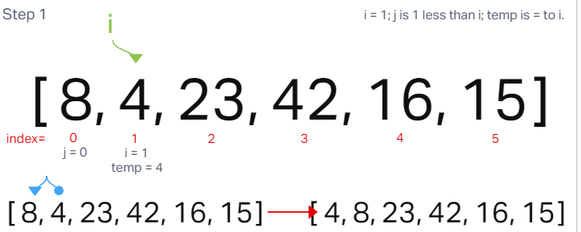
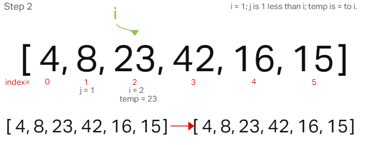
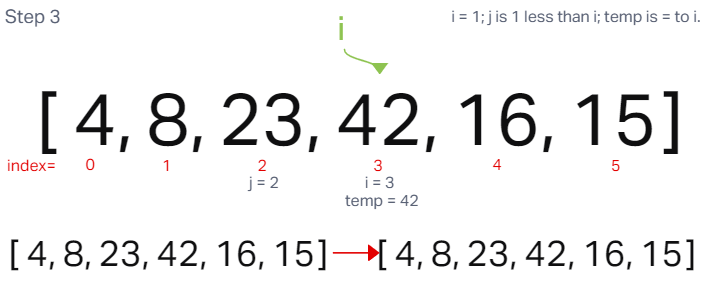
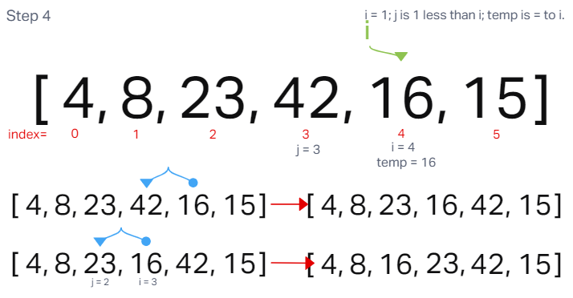
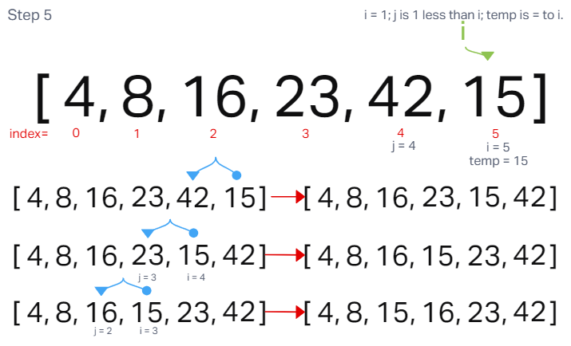

# Insertion Sort

Insertion sort is an array sorting algorithm which splits an array into *'sorted'* and *'non-sorted'* parts. As each value(element) of the unsorted part of the array is iterated over, and places values at the correct position in the sorted part of the array. The process is repeated until all of the values in the unsorted part of the array have been placed in order in the sorted portion, resulting in a sorted array.

We traverse the array with a for loop which starts at index 1 and, using a while loop, checks the value at the current index (assigned as *temp*) against the the value of the preceding index. If the *temp* value is less than that of the previous index, the two values are switched. If the value of *temp* is equal to, or higher than the value of the preceding index, no values are changed and the for loop continues.

If a switch of values occurs, the same comparison will be carried out for the index where the *temp* value now resides and the value of the index now preceding it. If the value of *temp* is less, the values of the two indexes are switched.

The process continues until either the value of *temp* is no longer less than the value of the preceding index, or until there is no longer a preceding index, at which point *temp* would become the new first value in the array.

## Provided pseudocode

~~~js
InsertionSort(int[] arr)

  FOR i = 1 to arr.length

    int j <-- i - 1
    int temp <-- arr[i]

    WHILE j >= 0 AND temp < arr[j]
      arr[j+1] <-- arr[j]
      j <-- j - 1

    arr[j+1] <-- temp
~~~

#### Sample Array: [8, 4, 23, 42, 16, 15]

**Step One:**

During the first pass of insertionSort, the *temp* value of 4 is compared to value 8. Because it is lower in value and `j` is >= 0, the value of 8 is assigned to index 1. Then the value of `j` is decremented by 1. Because the value of `j` is now -1, the value of 4 is assigned to index 0 and the while loop ends with 4 as the new beginning.

**Step Two:**

In the next iteration, the *temp* value is 23. When 23 is compared to the preceding index of 8, it is not lower and, therefore, the while loop doesn't start. The value of 23 is reassigned to its original position at index 2 and `j` is currently at 1.

**Step Three:**

Similarly, in the third pass, the *temp* value is 42. Again, 42 is compared to the preceding value of 23, and it's not lower and, therefore, the while loop does not start. The value of 42 is reassigned to its original position at index 3 and `j` is currently 2.

**Step Four:**

In the fourth pass, the *temp* value is 16. 16 is compared to 42, and because it is lower, 42 is assigned to index 4 and `j` is decremented from 3 to 2. The while loop runs again because `j` is still >= to 0 and 16 is now less than the value at index 2, which is 23. 23 is assigned to index 3 and `j` is decremented again to 1. While `j` is still >= 0, the *temp* value of 16 is not less than the value at index 1, which is 8. So the while loop finishes and the value of 16 is assigned to index 2.

**Step Five:**

Finally, in the fifth pass, the *temp* value becomes 15. 15 is compared to 42 at index 4, and because it's lower, the value of 42 is assigned to index 5 and `j` decrements to 3. The while loop runs again because `j` is still >= to 0 and 15 is less than 23, the value at index 3. 23 is assigned to index 4 and `j` is decremented again to 2. The value at index 2 is 16 which is larger than 15. So the value of 16 is assigned to index 3 and `j` decrements to 1. While `j` is still >= 0, the *temp* value of 15 is greater than the value at index 1, which is 8. So the while loop finishes and the value of 15 is assigned to index 2.

The for loop ends, the array has been sorted and returns:

**[ 4, 8, 15, 16, 23, 42 ]**

---

## Big Oh's

- Time Complexity: O(n^2)
- Space Complexity: O(1)

## Code

~~~js
const insertionSort = (arr) => {
  for(let i = 1 ; i < arr.length ; i++) {
    let j = i-1;
    let temp = arr[i];

    while( j >= 0 && temp < arr[j]) {
      arr[j+1] = arr[j];
      j--;
    }
    arr[j+1] = temp;
  }
  return arr;
};
~~~

[Solution](/insertionSort/insertionSort.js)

---
[Back](README.md)

---
