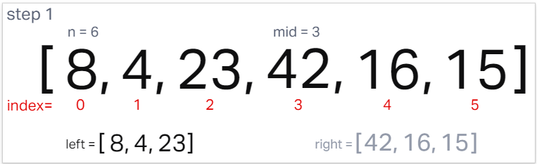
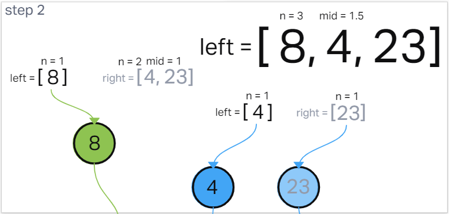
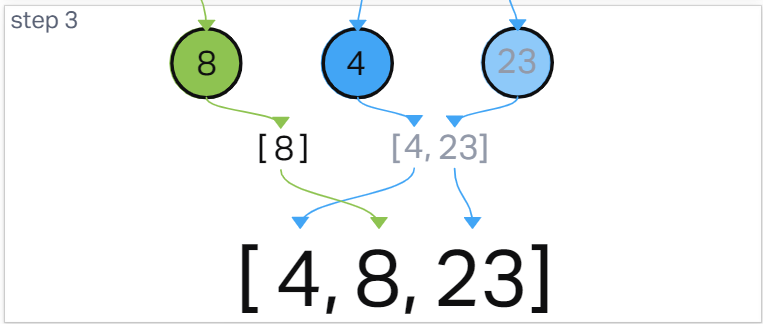
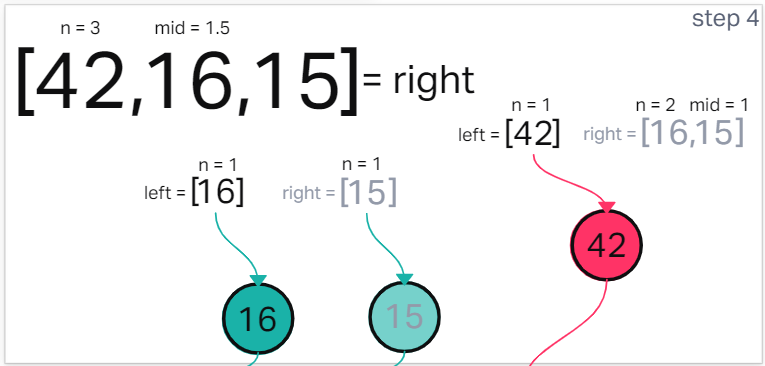
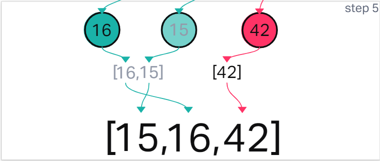
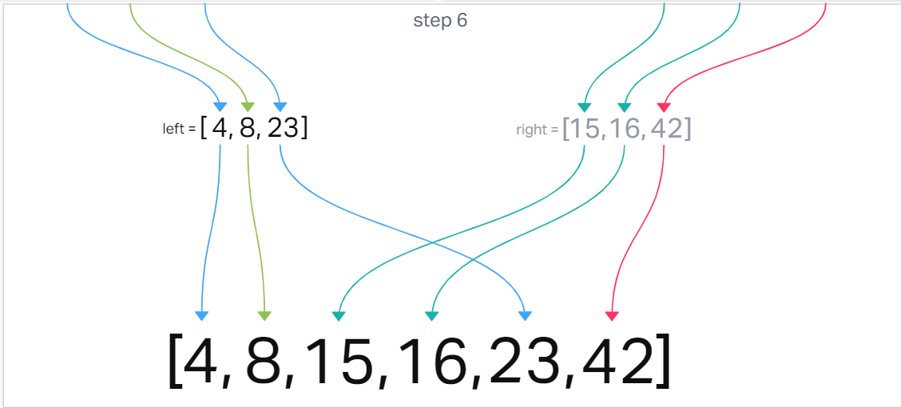

# Merge Sort

Merge sort is an array sorting algorithm which recursively splits an array in half, until each half of the array has one, or no indexes. At this point, each division is *'sorted'*.

Because the array has only 1 element in it, it will always be in order. So the singleton arrays are recombined simarlarly, into the 2 half arrays again, but with one difference.

The values of our current two arrays that are being recombined are iterated over. The lowest value is placed first in the larger array. As the recombining arrays combine from 1 to 2 to 4 and so on in length, the growing array will always be in sorted order.

This continues until all of the smaller arrays are recombined into an array the same length as the original, now with its elements sorted.

## Provided pseudocode

~~~js
ALGORITHM Mergesort(arr)
  DECLARE n <-- arr.length

  if n > 1
    DECLARE mid <-- n/2
    DECLARE left <-- arr[0...mid]
    DECLARE right <-- arr[mid...n]

    Mergesort(left)
    Mergesort(right)
    Merge(left, right, arr)

ALGORITHM Merge(left, right, arr)
  DECLARE i <-- 0
  DECLARE j <-- 0
  DECLARE k <-- 0

  while i < left.length && j < right.length
    if left[i] <= right[j]
      arr[k] <-- left[i]
      i <-- i + 1
    else
      arr[k] <-- right[j]
      j <-- j + 1
    k <-- k + 1
  if i = left.length
    set remaining entries in arr to remaining values in right
  else
    set remaining entries in arr to remaining values in left
~~~

#### Sample Array: [8, 4, 23, 42, 16, 15]

**Step One:**

First,  we split the array in half, as evenly as possible. `mergeSort()` is then called for the left sub-array.

**Step Two:**

The left sub-array is split as evenly possible. The result here is a left sub-array with 1 value and a right sub-array with 2 values. We call `mergeSort()` for the right sub-array containing two values resulting in 2 sub-arrays with one value each. The entire left side of the original array has now been reduced.

**Step Three:**

Now the sub-divided arrays are merged into a sorted order, using logic that compares the values of the indexes of combining arrays. This continues until the left half of the array is reassembled in sorted order.

**Step Four:**

We then call `mergeSort()` for the right sub-array. Again, the sub-array is split as evenly possible. The result is a left sub-array with one value and a right sub-array with 2 values. `mergeSort()` is then called for the right sub-array containing the 2 values resulting in 2 sub-arrays with one value each. The entire right side of the original array has been reduced.

**Step Five:**

Now, the sub-divided arrays are merged in sorted order using the same logic that was used for the left side. This continues until the right half of the array is reassembled in sorted a order.

**Step Six:**

To finish, the two sorted halves of the array are merged back into the original which is now a completely sorted array.

**[ 4, 8, 15, 16, 23, 42 ]**

---

## Big Oh's

- Time Complexity: **O(nLogn)**
- Space Complexity: **O(n)**

## The Code

~~~js
const mergeSort = (arr) => {
  let n = arr.length;

  if(n > 1) {
    let mid = (n/2);
    let left = arr.slice(0, mid);
    let right = arr.slice(mid);
    mergeSort(left);
    mergeSort(right);
    merge(left, right, arr);
  }
  return arr;
};

const merge = (left, right, arr) => {
  let i = 0;
  let j = 0;
  let k = 0;

  while(i < left.length && j < right.length) {
    if(left[i] < right[j]) {
      arr[k] = left[i];
      i++;
    } else {
      arr[k] = right[j];
      j++;
    }
    k++;
  }
  while(i < left.length) {
    arr[k] = left[i];
    i++;
    k++;
  }
  while(j < right.length) {
    arr[k] = right[j];
    j++;
    k++;
  }
};

module.exports = {
  mergeSort: mergeSort,
  merge: merge,
};
~~~

[Solution](/mergeSort/mergeSort.js)

---
[Back](/README.md)

---
