# Quick Sort

Quick sort is an array sorting algorithm which partitions an array based on an assigned 'pivot'.The partioned arrays contain values which are less than the pivot value in 1 sub-array, and more than the pivot value in the other sub-arry.

The sub-arrays are then recursively sorted, by either swapping elements, or further partioning the sections of the array. Once the recursive sorts are complete, the array will be completely sorted.

## Provided pseudocode

~~~js
ALGORITHM QuickSort(arr, left, right)
  if left < right
    DEFINE position <-- Partition(arr, left, right)
    QuickSort(arr, left, position - 1)
    QuickSort(arr, position + 1, right)

ALGORITHM Partition(arr, left, right)
  DEFINE pivot <-- arr[right]
  DEFINE low <-- left - 1

  for i <- left to right do
    if arr[i] <= pivot
      low++
      Swap(arr, i, low)
  Swap(arr, right, low + 1)
  return low + 1

ALGORITHM Swap(arr, i, low)
  DEFINE temp;
  temp <-- arr[i]
  arr[i] <-- arr[low]
  arr[low] <-- temp
~~~

#### Sample Array: [8, 4, 23, 42, 16, 15]

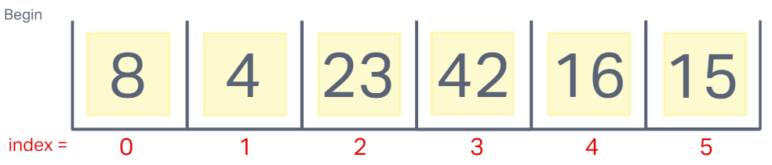

**Step One:**

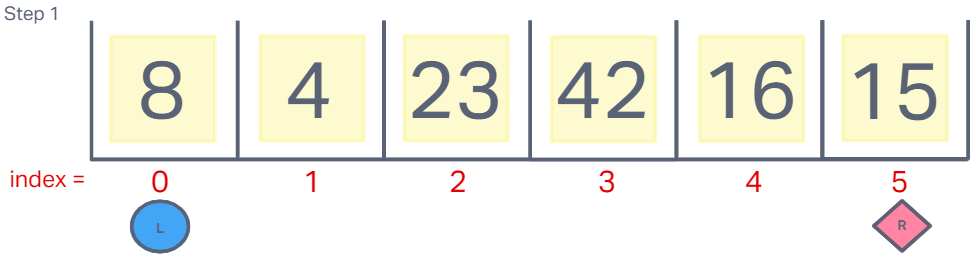

A left (index 0) and a right (array.length-1) (index 5 in our sample) are assigned. `Left` & `right`are compare and `left` is less than `right`, so `quickSort()` proceeds to call `partition()`.

**Step Two:**

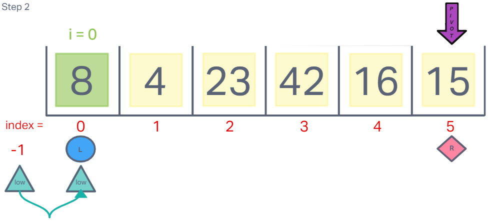

Within the partition function, a pivot value is assigned, which is `15` here. A `low` variable is assigned to `left` - 1 index position, and a 'for' loop begins with `i` equal to `left`, (index 0) and `low` equal to -1.

Because 8, the value of arr[i] is less than the pivot value of 15, the 'if' loop activates and increments `low` to index 0 and then swaps the position of arr[low] and arr[i], which in this case, keeps 8 in the arr[0] position.

**Step Three:**

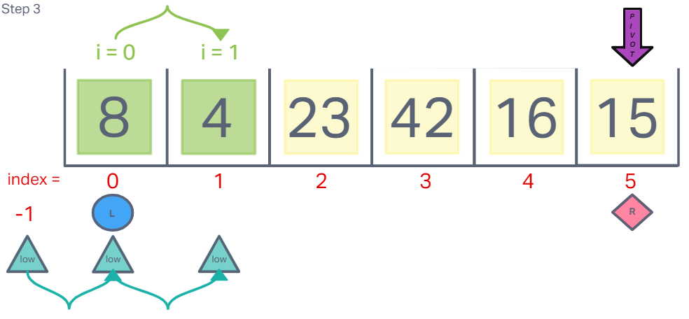

`i` increments to index 1. The value 4 is compared to 15 and is lower. The 'if' loop fires again, incrementing `low` to index 1 and "swapping" the 4 with itself.

**Step Four:**

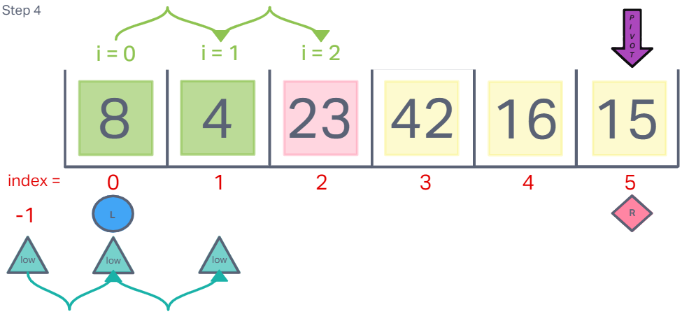

`i` increases to index 2. When 23 is compared to the pivot value of 15, it is NOT less and therefore the 'if' loop does nothing. `low` remains with a value of 1.

**Step Five:**

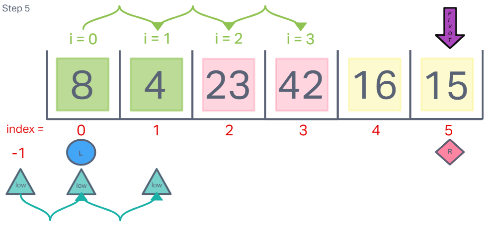

`i` increments to index 3. Again, 42 is not less than 15 and the 'if' loop is not activated. `low` is still at index 1.

**Step Six:**

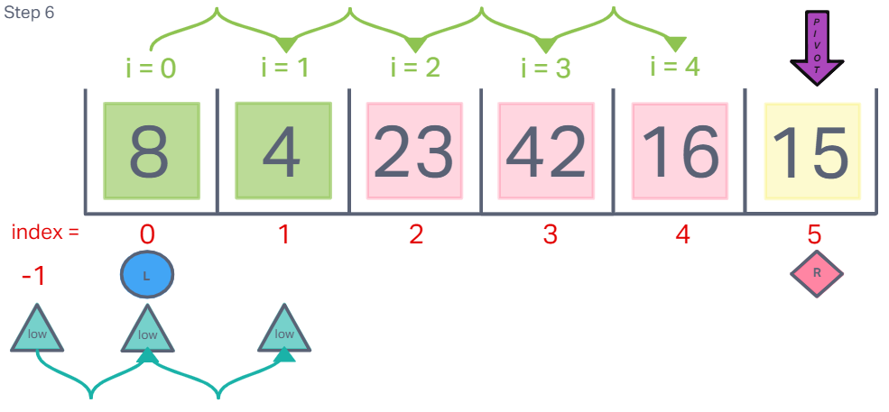

`i` increments to index 4. 16 evaluates greater than 15. The 'if' loop does not activate. `low` remains at 1 still.

**Step Seven:**

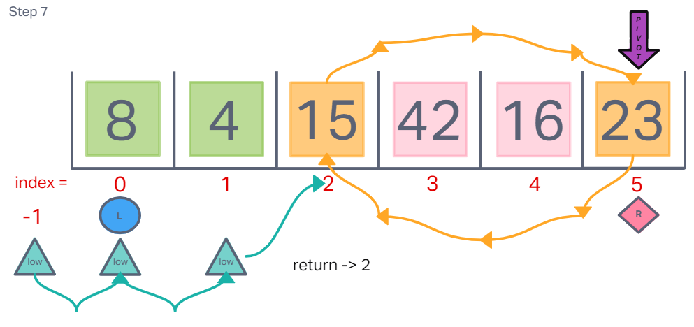

The 'for' loop ends. The values at index `low` + 1 (index 2) and right (index 5) are now swapped, and `low` + 1 (at index 2) is returned from `partition()` and assigned to the `position` (pivot) variable in the `quickSort()` function.

**Step Eight:**

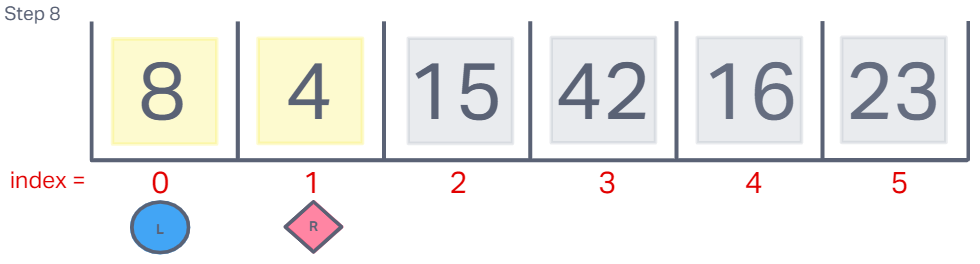

Next, the recursive `quickSort()` function is called again for the left partition of the array with a left value of index 0 and a right value of index 1 (`position` - 1).

**Step Nine:**

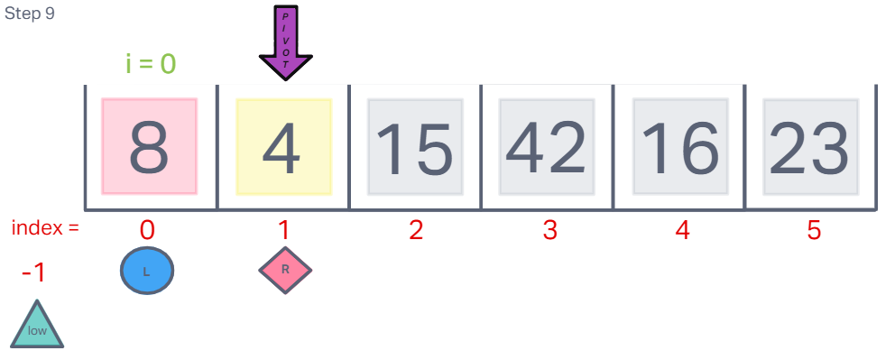

Since `left` is less than `right`, `partition()` is called again. `pivot` is set to 4, `low` is set to -1, and the 'for' loop runs. Because 8 is not less than 4, `low` is not incremented and the 'for' loop ends.

**Step Ten:**

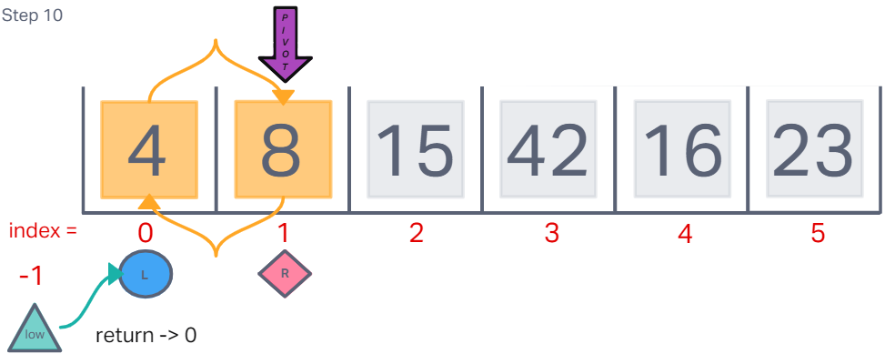

The values at index `low` + 1 (index 0) and right (index 1) are now swapped, and `low` + 1 (index 0) is returned from `partition()` and assigned to the `position` variable in the `quickSort()` function.

**Step Eleven:**

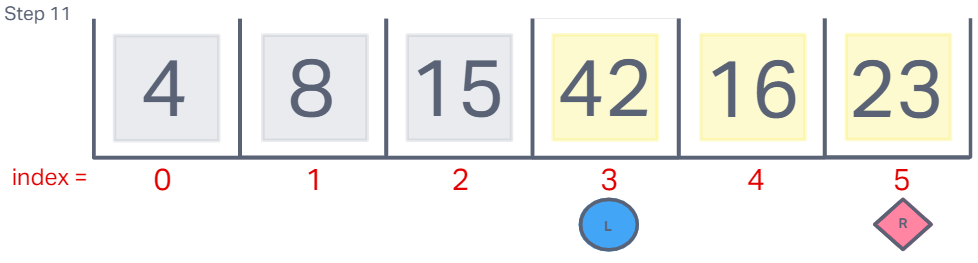

Here `left` is not less than `right` and this bit of recursion ends and the previous `quickSort()` function picks up with a `position` value of 2. The second recursive `quickSort()` function is called for the right partition of the array with a left value of 3 (`position` + 1) and a right value of 5 (array.length - 1).

**Step Twelve:**

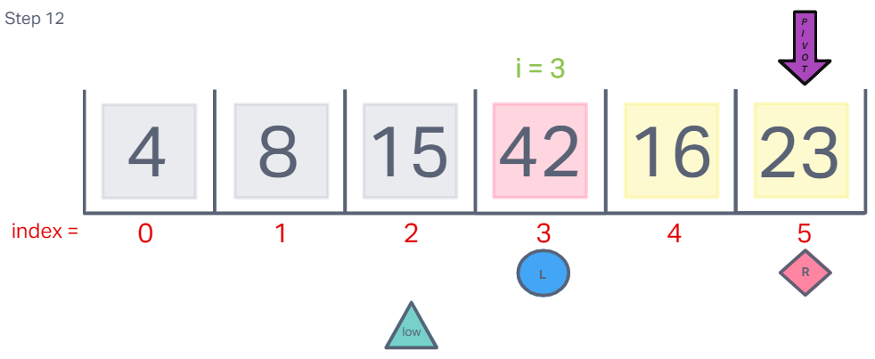

`left` is less than `right`, so `partition()` is called. Within partition, a pivot value of `23` is assigned, a `low` variable is assigned to (`left` - 1), and a 'for' loop is begun with `i` equal to `left` (3) and and `low` equal to 2. Because 42 is not less than 23, the 'if' loop is not activated. `low` retains a value of 2.

**Step Thirteen:**

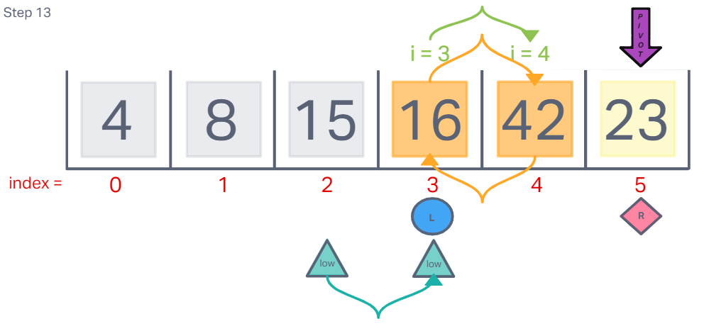

`i` increments to 4. The value of 16 is found to be less than 23 and so the 'if' loop activates. `low` is incremented to 3, and then the values at arr[low] (value 42) and arr[i] (value 16) are swapped.

**Step Fourteen:**

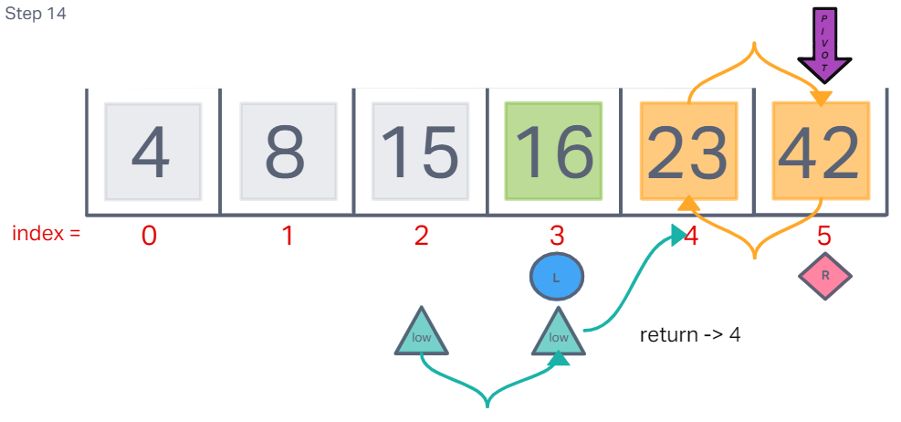

The 'for' loop now ends the for last time. The values at right (23) and arr[`low`+1] (42) are swapped. 4 is returned from `partition()`, which will prevent any further recursion because `left` will no longer be less than `right`.

**Step Fifteen:**

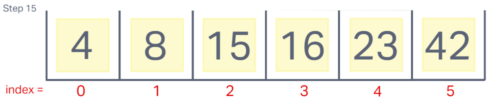

The function is complete and the array is now sorted.

**[ 4, 8, 15, 16, 23, 42 ]**

---

## Big Oh's

- Time Complexity: O(nLogn)
- Space Complexity: O(1)

## The Code

~~~js
const quickSort = (arr, left = 0, right = undefined) => {
  if(left < right) {
    let position = partition(arr, left, right);
    quickSort(arr, left, position - 1);
    quickSort(arr, position + 1, right);
  }
  return arr;
};
const partition = (arr, left, right) => {
  if(arr === undefined) {
    return;
  }
  let pivot = arr[right];
  let low = left - 1;
  for(let i = left ; i < right ; i++) {
    if(arr[i] <= pivot) {
      low++;
      swap(arr, i, low);
    }
  }
  swap(arr, right, low + 1);
  return low + 1;
};
const swap = (arr, i, low) => {
  if(arr === undefined) {
    return;
  }
  let temp;
  temp = arr[i];
  arr[i] = arr[low];
  arr[low] = temp;
};
~~~

[Solution](quickSort.js)